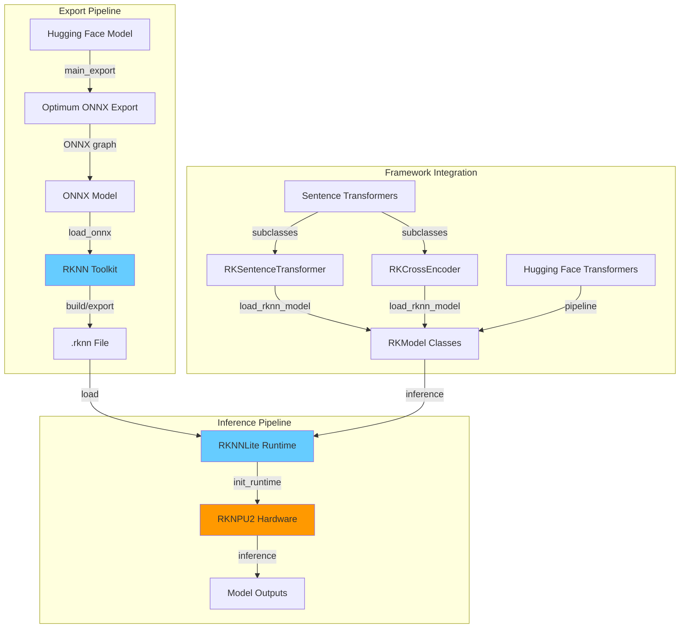

# RK-Transformers: Accelerate Hugging Face Transformers on Rockchip NPUs

<div align="center">

[](https://huggingface.co/rk-transformers)
[](https://emapco.github.io/rk-transformers/)
[](https://www.python.org/downloads/)
[](https://pypi.org/project/rk-transformers/)
[](https://github.com/emapco/rk-transformers/actions/workflows/ci.yaml)
[](https://pypi.org/project/rk-transformers/)
[](https://github.com/emapco/rk-transformers/blob/main/LICENSE)
[](https://github.com/emapco/rk-transformers)

</div>

**RK-Transformers** is a runtime library that seamlessly integrates Hugging Face `transformers` and `sentence-transformers` with Rockchip's RKNN Neural Processing Units (NPUs). It enables efficient and facile deployment of transformer models on edge devices powered by Rockchip SoCs (RK3588, RK3576, etc.).

## ✨ Key Features

### 🔄 Model Export & Conversion

- **Automatic ONNX Export**: Converts Hugging Face models to ONNX with input detection
- **RKNN Optimization**: Exports to RKNN format with configurable optimization levels (0-3)
- **Quantization**: INT8 (w8a8) quantization with calibration dataset support
- **Push to Hub**: Direct integration with Hugging Face Hub for model versioning

### ⚡ High-Performance Inference

- **NPU Acceleration**: Leverage Rockchip's hardware NPU for 10-20x speedup
- **Multi-Core Support**: Automatic core selection and load balancing across NPU cores
- **Memory Efficient**: Optimized for edge devices with limited RAM

### 🧩 Framework Integration

- **Sentence Transformers**: Drop-in replacement with `RKSentenceTransformer` and `RKCrossEncoder`
- **Transformers API**: Compatible with standard Hugging Face pipelines

## 📦 Installation

### Prerequisites

- Python 3.10 - 3.12
- Linux-based OS (Ubuntu 24.04+ recommended)
- For export: PC with x86_64/arm64 architecture
- For inference: Rockchip device with RKNPU2 support (RK3588, RK3576, etc.)

### Quick Install

`uv` is recommended for faster installation and smaller environment footprint.

#### For Inference (on Rockchip devices [arm64])

```bash
uv venv
uv pip install rk-transformers[inference]
```

This installs runtime dependencies including:

- `rknn-toolkit-lite2` (2.3.2)
- `sentence-transformers` (5.x)
- `numpy`, `torch`, `transformers`

#### For Model Export (on development machines [x86_64, arm64])

```bash
uv venv
uv pip install rk-transformers[dev,export]
uv pip install torch==2.6.0+cpu --index-url https://download.pytorch.org/whl/cpu # workaround for rknn-toolkit2 dependency
```

This installs export dependencies including:

- `rknn-toolkit2` (2.3.2)
- `sentence-transformers` (5.x)
- `numpy`, `torch`, `transformers`, `optimum[onnx]`, `datasets`

#### For Development (on development machines [x86_64, arm64])

```bash
# Clone the repository
git clone https://github.com/emapco/rk-transformers.git
cd rk-transformers

# Install with development tools
uv venv
uv pip install -e .[dev,export]
uv pip install torch==2.6.0+cpu --index-url https://download.pytorch.org/whl/cpu # workaround for rknn-toolkit2 dependency
```

## 🎯 Quick Start

### 1. Export a Model to RKNN

```bash
# Display help message with available options
rk-transformers-cli export -h 

# Export a Sentence Transformer model from Hugging Face Hub (float16)
rk-transformers-cli export \
  --model sentence-transformers/all-MiniLM-L6-v2 \
  --platform rk3588 \
  --flash-attention \
  --optimization-level 3

# Export with custom dataset for quantization (int8)
rk-transformers-cli export \
  --model sentence-transformers/all-MiniLM-L6-v2 \
  --platform rk3588 \
  --flash-attention \
  --quantize \
  --dtype w8a8 \
  --dataset sentence-transformers/natural-questions \
  --dataset-split train \
  --dataset-columns answer \
  --dataset-size 128 \
  --max-seq-length 128 # Default is 512

# Export a local ONNX model
rk-transformers-cli export \
  --model ./my-model/model.onnx \
  --platform rk3588 \
  --flash-attention \
  --batch-size 4 # Default is 1
```

### 2. Run Inference with Sentence Transformers

#### SentenceTransformer

```python
from rktransformers import RKSentenceTransformer

model = RKSentenceTransformer(
    "rk-transformers/all-MiniLM-L6-v2",
    model_kwargs={
        "platform": "rk3588",
        "core_mask": "all",
    },
)

sentences = ["This is a test sentence", "Another example"]
embeddings = model.encode(sentences)
print(embeddings.shape)  # (2, 384)

# Load specific quantized model file
model = RKSentenceTransformer(
    "rk-transformers/all-MiniLM-L6-v2",
    model_kwargs={
        "platform": "rk3588",
        "file_name": "rknn/model_w8a8.rknn",
    },
)
```

#### CrossEncoder

```python
from rktransformers import RKCrossEncoder

model = RKCrossEncoder(
    "rk-transformers/ms-marco-MiniLM-L12-v2",
    model_kwargs={"platform": "rk3588", "core_mask": "auto"},
)

pairs = [
    ["How old are you?", "What is your age?"],
    ["Hello world", "Hi there!"],
    ["What is RKNN?", "This is a test."],
]
scores = model.predict(pairs)
print(scores)

query = "Hi there!"
documents = [
    "What is going on?",
    "I am 25 years old.",
    "This is a test.",
    "RKNN is a neural network toolkit.",
]
results = model.rank(query, documents)
print(results)

# Load specific quantized model file
model = RKCrossEncoder(
    "rk-transformers/ms-marco-MiniLM-L12-v2",
    model_kwargs={
        "platform": "rk3588",
        "file_name": "rknn/model_w8a8.rknn",
    },
)
```

### 3. Use RK-Transformers API

View the docs for all supported models and their example usage.

```python
from transformers import AutoTokenizer

from rktransformers import RKModelForFeatureExtraction

# Load tokenizer and model
tokenizer = AutoTokenizer.from_pretrained("rk-transformers/all-MiniLM-L6-v2")
model = RKModelForFeatureExtraction.from_pretrained("rk-transformers/all-MiniLM-L6-v2", platform="rk3588", core_mask="auto")

# Tokenize and run inference
inputs = tokenizer(
    ["Sample text for embedding"],
    padding="max_length",
    truncation=True,
    return_tensors="np",
)

outputs = model(**inputs)
embeddings = outputs.last_hidden_state.mean(axis=1)  # Mean pooling
print(embeddings.shape)  # (1, 384)

# Load specific quantized model file
model = RKModelForFeatureExtraction.from_pretrained(
    "rk-transformers/all-MiniLM-L6-v2", platform="rk3588", file_name="rknn/model_w8a8.rknn"
)
```

### 4. Use Transformers Pipelines

```python
from transformers import pipeline

from rktransformers import RKModelForMaskedLM

# Load the RKNN model
model = RKModelForMaskedLM.from_pretrained(
    "rk-transformers/bert-base-uncased", platform="rk3588", file_name="rknn/model_w8a8.rknn"
)

# Create a fill-mask pipeline with the RKNN-accelerated model
fill_mask = pipeline(
    "fill-mask",
    model=model,
    tokenizer="rk-transformers/bert-base-uncased",
    framework="pt",  # required for RKNN
)

# Run inference
results = fill_mask("Paris is the [MASK] of France.")
print(results)
```

## ⚙️ NPU Core Configuration

Rockchip SoCs with multiple NPU cores (like RK3588 with 3 cores or RK3576 with 2 cores) support flexible core allocation strategies through the `core_mask` parameter. Choosing the right core mask can optimize performance based on your workload and system conditions. For more details, refer to the [RK-Transformers docs](https://emapco.github.io/rk-transformers/user_guide/npu_cores.html).

### Available Core Mask Options

> **Note**: `core_mask` is specified at inference time.

| Value         | Description                                     | Use Case                                                                                   |
| ------------- | ----------------------------------------------- | ------------------------------------------------------------------------------------------ |
| **`"auto"`**  | Automatic mode - selects idle cores dynamically | **Recommended**: Best for most scenarios, `RKNN runtime` provides load balancing           |
| **`"0"`**     | NPU Core 0 only                                 | Fixed core assignment                                                                      |
| **`"1"`**     | NPU Core 1 only                                 | Fixed core assignment                                                                      |
| **`"2"`**     | NPU Core 2 only                                 | Fixed core assignment (RK3588 only)                                                        |
| **`"0_1"`**   | NPU Core 0 and 1 simultaneously                 | Parallel execution across 2 cores for larger models                                        |
| **`"0_1_2"`** | NPU Core 0, 1, and 2 simultaneously             | Maximum parallelism (RK3588 only) for demanding models                                     |
| **`"all"`**   | All available NPU cores                         | Equivalent to `"0_1_2"` on RK3588, `"0_1"` on RK3576                                       |

### Usage Examples

#### RK-Transformers API

```python
from rktransformers import RKModelForFeatureExtraction

# Auto-select idle cores (recommended for production)
model = RKModelForFeatureExtraction.from_pretrained("rk-transformers/all-MiniLM-L6-v2", platform="rk3588", core_mask="auto")

# Use specific core for dedicated workloads
model = RKModelForFeatureExtraction.from_pretrained(
    "rk-transformers/all-MiniLM-L6-v2",
    platform="rk3588",
    core_mask="1",  # Reserve core 0 for other tasks
)

# Use all cores for maximum performance
model = RKModelForFeatureExtraction.from_pretrained("rk-transformers/all-MiniLM-L6-v2", platform="rk3588", core_mask="all")
```

#### Sentence Transformers Integration

```python
from rktransformers import RKSentenceTransformer, RKCrossEncoder

model = RKSentenceTransformer(
    "rk-transformers/all-MiniLM-L6-v2",
    model_kwargs={
        "platform": "rk3588",
        "core_mask": "auto",
    },
)

model = RKCrossEncoder(
    "rk-transformers/ms-marco-MiniLM-L12-v2",
    model_kwargs={
        "platform": "rk3588",
        "core_mask": "auto",
    },
)
```

## Architecture

### Runtime Loading Workflow

1. **Model Discovery**: `RKModel.from_pretrained()` searches for `.rknn` files
2. **Config Matching**: Reads the rknn config in `config.json` to match platform and constraints
3. **Platform Validation**: Checks compatibility with `RKNNLite.list_support_target_platform()`
4. **Runtime Init**: Loads model to NPU with specified core mask
5. **Inference**: Runs forward pass with automatic input/output handling

### Cross-Component Communication



### Configuration Files

#### `config.json`

The RKNN configuration is stored within the model's `config.json` file under the `"rknn"` key:

```json
{
  "architectures": ["BertModel"],
  ...
  "rknn": {
    "model.rknn": {
      "platform": "rk3588",
      "batch_size": 1,
      "max_seq_length": 128,
      "model_input_names": ["input_ids", "attention_mask"],
      "quantized_dtype": "w8a8",
      "optimization_level": 3,
      ...
    },
    "rknn/optimized.rknn": {
      ...
    }
  }
}
```

The keys in the `"rknn"` object are relative paths to `.rknn` files, allowing multiple optimized variants per model.

## 🤝 Contributing

We welcome contributions! Please see [CONTRIBUTING.md](CONTRIBUTING.md) for guidelines.

## 📄 License

This project is licensed under the **Apache License 2.0**.

## 🙏 Acknowledgments

- **Hugging Face** for the `transformers`, `sentence-transformers` and `optimum` libraries
- **Rockchip** for RKNN toolkit and NPU hardware

## 🔗 Links

- **Repository**: [https://github.com/emapco/rk-transformers](https://github.com/emapco/rk-transformers)
- **Issues**: [https://github.com/emapco/rk-transformers/issues](https://github.com/emapco/rk-transformers/issues)
- **Changelog**: [https://github.com/emapco/rk-transformers/releases](https://github.com/emapco/rk-transformers/releases)
- **Rockchip RKNN Toolkit2 Docs**: [https://github.com/airockchip/rknn-toolkit2](https://github.com/airockchip/rknn-toolkit2/tree/master/doc)
