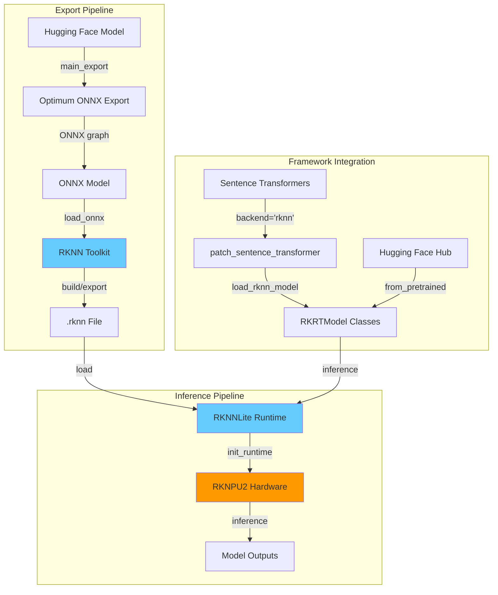

# RK-Transformers: Accelerate Hugging Face Transformers on Rockchip NPUs

<div align="center">

[](https://opensource.org/licenses/Apache-2.0)
[](https://www.python.org/downloads/)
[](https://github.com/emapco/rk-transformers)
[](https://github.com/emapco/rk-transformers)

</div>

## 🚀 Overview

**RK-Transformers** is a runtime library that seamlessly integrates Hugging Face `transformers` and `sentence-transformers` with Rockchip's RKNN Neural Processing Units (NPUs). It enables efficient and facile deployment of transformer models on edge devices powered by Rockchip SoCs (RK3588, RK3576, etc.).

## ✨ Key Features

### 🔄 Model Export & Conversion

- **Automatic ONNX Export**: Converts Hugging Face models to ONNX with intelligent input detection
- **RKNN Optimization**: Exports to RKNN format with configurable optimization levels (O0-O3)
- **Quantization**: Post-training quantization (INT8, FP16) with calibration dataset support
- **Push to Hub**: Direct integration with Hugging Face Hub for model versioning

### ⚡ High-Performance Inference

- **NPU Acceleration**: Leverage Rockchip's hardware NPU for 10-100x speedup
- **Multi-Core Support**: Automatic core selection and load balancing across NPU cores
- **Memory Efficient**: Optimized for edge devices with limited RAM

### 🧩 Framework Integration

- **Sentence Transformers**: Drop-in replacement with `backend="rknn"` parameter
- **Transformers API**: Compatible with standard Hugging Face pipelines
- **Multiple Tasks**: Feature extraction, masked LM, sequence classification

### 🛠️ Developer Experience

- **CLI Tools**: Powerful `rk-transformers-cli` for model export and environment diagnostics
- **CI/CD**: Automated testing across Python 3.10, 3.11, and 3.12

## 📦 Installation

### Prerequisites

- Python 3.10 or later
- Linux-based OS (Ubuntu 24.04+ recommended)
- For export: PC with x86_64 architecture
- For inference: Rockchip device with RKNPU2 support (RK3588, RK3576, etc.)

### Quick Install

`uv` is recommended for faster installation and smaller environment footprint.

#### For Inference (on Rockchip devices)

```bash
uv pip install rk-transformers[inference]
```

This installs runtime dependencies including:

- `rknn-toolkit-lite2` (2.3.2)
- `sentence-transformers` (5.x)
- `numpy`, `torch`, `transformers`

#### For Model Export (on development machines)

```bash
uv pip install rk-transformers[export]
```

This installs export dependencies including:

- `rknn-toolkit2` (2.3.2)
- `optimum[onnx]`, `datasets`
- All inference dependencies (except `rknn-toolkit-lite2`)

#### For Development

```bash
# Clone the repository
git clone https://github.com/emapco/rk-transformers.git
cd rk-transformers

# Install with development tools
uv pip install -e .[dev,export]
```

Development dependencies include:

- `pytest`, `pytest-cov`, `pytest-xdist`
- `ruff` (linting and formatting)
- `pre-commit` (git hooks)

## 🎯 Quick Start

### 1. Export a Model to RKNN

```bash
# Export a Sentence Transformer model from Hugging Face Hub (float16)
rk-transformers-cli export \
  --model sentence-transformers/all-MiniLM-L6-v2 \
  --platform rk3588 \
  --optimization-level 3 \
  --opset 19  # Default is 18

# Export with custom dataset for quantization (int8)
rk-transformers-cli export \
  --model sentence-transformers/all-MiniLM-L6-v2 \
  --platform rk3588 \
  --quantize \
  --dtype w8a8 \
  --dataset sentence-transformers/natural-questions \
  --dataset-split test \
  --dataset-size 128 \
  --max-seq-length 128 # default is 256

# Export a local ONNX model
rk-transformers-cli export \
  --model ./my-model/model.onnx \
  --platform rk3588 \
  --batch-size 4 # Default is 1
```

### 2. Run Inference with Sentence Transformers

```python
from sentence_transformers import SentenceTransformer
from rktransformers import patch_sentence_transformer

# Apply RKNN backend patch
patch_sentence_transformer()

# Load model with RKNN backend
model = SentenceTransformer(
    "./all-MiniLM-L6-v2",
    backend="rknn",
    model_kwargs={"platform": "rk3588", "core_mask": "all"}
)

# Generate embeddings
sentences = ["This is a test sentence", "Another example"]
embeddings = model.encode(sentences)
print(embeddings.shape)  # (2, 384)

# Load specific quantized model file
model = SentenceTransformer(
    "./all-MiniLM-L6-v2",
    backend="rknn",
    model_kwargs={
        "platform": "rk3588",
        "file_name": "rknn/model_w8a8.rknn"
    }
)
```

### 3. Use RK-Transformers API Directly

```python
from rktransformers import RKRTModelForFeatureExtraction
from transformers import AutoTokenizer

# Load tokenizer and model
tokenizer = AutoTokenizer.from_pretrained("./all-MiniLM-L6-v2")
model = RKRTModelForFeatureExtraction.from_pretrained(
    "./all-MiniLM-L6-v2",
    platform="rk3588",
    core_mask="auto"
)

# Tokenize and run inference
inputs = tokenizer(
    ["Sample text for embedding"],
    padding="max_length",
    max_length=128,
    truncation=True,
    return_tensors="np"
)

outputs = model(**inputs)
embeddings = outputs.last_hidden_state.mean(dim=1)  # Mean pooling
print(embeddings.shape)  # (1, 384)

# Load specific quantized model file
model = RKRTModelForFeatureExtraction.from_pretrained(
    "./all-MiniLM-L6-v2",
    platform="rk3588",
    file_name="rknn/model_w8a8.rknn"
)
```

### 4. Export Programmatically

```python
from rktransformers import export_rknn, RKNNConfig, QuantizationConfig, OptimizationConfig

# Configure export
config = RKNNConfig(
    model_id_or_path="sentence-transformers/all-MiniLM-L6-v2",
    output_path="./my-exported-model",
    platform="rk3588",
    batch_size=1,
    max_seq_length=128,
    quantization=QuantizationConfig(
        quantized_dtype="w8a8",
        dataset_name="wikitext",
        dataset_size=100,
    ),
    optimization=OptimizationConfig(
        optimization_level=3,
        target_platform="rk3588"
    )
)

# Run export
export_rknn(config)
```

## ⚙️ NPU Core Configuration

Rockchip SoCs with multiple NPU cores (like RK3588 with 3 cores or RK3576 with 2 cores) support flexible core allocation strategies through the `core_mask` parameter. Choosing the right core mask can optimize performance based on your workload and system conditions.

### Available Core Mask Options

> **Note**: `core_mask` is specified at inference time.

| Value         | Description                                     | Use Case                                                                                   |
| ------------- | ----------------------------------------------- | ------------------------------------------------------------------------------------------ |
| **`"auto"`**  | Automatic mode - selects idle cores dynamically | **Recommended**: Best for most scenarios, `RKNN runtime` provides automatic load balancing |
| **`"0"`**     | NPU Core 0 only                                 | Fixed core assignment, useful for testing or when other cores are busy                     |
| **`"1"`**     | NPU Core 1 only                                 | Fixed core assignment                                                                      |
| **`"2"`**     | NPU Core 2 only                                 | Fixed core assignment (RK3588 only)                                                        |
| **`"0_1"`**   | NPU Core 0 and 1 simultaneously                 | Parallel execution across 2 cores for larger models                                        |
| **`"0_1_2"`** | NPU Core 0, 1, and 2 simultaneously             | Maximum parallelism (RK3588 only) for demanding models                                     |
| **`"all"`**   | All available NPU cores                         | Equivalent to `"0_1_2"` on RK3588, `"0_1"` on RK3576                                       |

#### Platform-Specific Notes

| Platform          | Available Cores   | Recommended Default                    |
| ----------------- | ----------------- | -------------------------------------- |
| **RK3588**        | 0, 1, 2 (3 cores) | `"auto"` or `"0_1_2"` for large models |
| **RK3576**        | 0, 1 (2 cores)    | `"auto"` or `"0_1"` for large models   |
| **RK3566/RK3568** | 0 (1 core)        | `"0"` (only option)                    |

> **Note**: Attempting to use unavailable cores (e.g., `"2"` on RK3576) may result in a runtime error.

### Usage Examples

#### Python API - Inference

```python
from rktransformers import RKRTModelForFeatureExtraction

# Auto-select idle cores (recommended for production)
model = RKRTModelForFeatureExtraction.from_pretrained(
    "sentence-transformers/all-MiniLM-L6-v2",
    platform="rk3588",
    core_mask="auto"
)

# Use specific core for dedicated workloads
model = RKRTModelForFeatureExtraction.from_pretrained(
    "my-model",
    platform="rk3588",
    core_mask="1"  # Reserve core 0 for other tasks
)

# Use all cores for maximum performance
model = RKRTModelForFeatureExtraction.from_pretrained(
    "large-model",
    platform="rk3588",
    core_mask="all"
)
```

#### Sentence Transformers Integration

```python
from sentence_transformers import SentenceTransformer
from rktransformers import patch_sentence_transformer

patch_sentence_transformer()

# Auto core selection
model = SentenceTransformer(
    "sentence-transformers/all-MiniLM-L6-v2",
    backend="rknn",
    model_kwargs={"platform": "rk3588", "core_mask": "auto"}
)

# Dual-core execution
model = SentenceTransformer(
    "sentence-transformers/all-MiniLM-L6-v2",
    backend="rknn",
    model_kwargs={"platform": "rk3588", "core_mask": "0_1"}
)
```

## ⚠️ Limitations

### Dynamic Inputs & Static Shapes

Current RKNN support for dynamic inputs is **experimental and not fully functional**. As a result, all models exported via `rk-transformers` use **static input shapes** defined at export time.

- **Performance Impact**: The NPU allocates memory based on the static shape. If you export with `max_seq_length=512` but only infer on 10 tokens, the NPU still processes the full 512-token padding, leading to inefficient inference.
- **Usage**: You must ensure your input tensors match the exported dimensions (or use padding).
- **Recommendation**: Export multiple versions of your model optimized for different sequence lengths (e.g., 128, 256, 512) if your workload varies significantly.

### Quantization Support

While the tool supports various quantization data types, many are **experimental**.

- **`w8a8` (Weights 8-bit, Activations 8-bit)**: The only widely supported and tested configuration. Recommended for most use cases.
- Other formats (e.g., `w8a16`, `w16a16i`) may cause conversion failures or runtime errors depending on the specific model operators and RKNN toolkit version.

## Architecture

#### Runtime Loading Workflow

1. **Model Discovery**: `RKRTModel.from_pretrained()` searches for `.rknn` files
2. **Config Matching**: Reads `rknn.json` to match platform and constraints
3. **Platform Validation**: Checks compatibility with `RKNNLite.list_support_target_platform()`
4. **Runtime Init**: Loads model to NPU with specified core mask
5. **Inference**: Runs forward pass with automatic input/output handling


### Cross-Component Communication



### Configuration Files

#### `rknn.json`

Generated during export and stored alongside the model:

```json
{
  "model.rknn": {
    "platform": "rk3588",
    "batch_size": 1,
    "max_seq_length": 128,
    "model_input_names": ["input_ids", "attention_mask"],
    "quantized_dtype": "w8a8",
    "optimization_level": 3,
    "rknn_version": "2.3.2",
    ...
  },
  "rknn/optimized.rknn": {
    "platform": "rk3588",
    "batch_size": 4,
    "max_seq_length": 256,
    "optimization_level": 3,
    "compress_weight": true,
    ...
  }
}
```

The keys are relative paths to `.rknn` files, allowing multiple optimized variants per model.

## 🤝 Contributing

We welcome contributions! Please see [CONTRIBUTING.md](CONTRIBUTING.md) for guidelines.

### Development Setup

```bash
git clone https://github.com/emapco/rk-transformers.git
cd rk-transformers
uv pip install -e .[dev,export]
pre-commit install
```

### Running Tests

```bash
# Run all tests (excludes manual tests)
make test

# Run with coverage report
make test-cov

# Run specific test categories
pytest -m integration tests -v          # Integration tests only
pytest -m "not slow" tests -v           # Skip slow tests
pytest -m requires_rknn tests -v        # Tests requiring RKNN hardware
```

### Linting and Formatting

```bash
# Auto-fix linting issues and format code
make lint

# Run pre-commit hooks manually
pre-commit run --all-files
```

### Environment Diagnostics

Check your Rockchip environment and library versions:

```bash
rk-transformers-cli env
```

Output example:

```bash
Copy-and-paste the text below in your GitHub issue:

- Operating system: Linux-5.10.160-rockchip-rk3588
- Rockchip Board: Orange Pi 5 Plus
- Rockchip SoC: rk3588
- RKNPU2 Driver version: 0.9.8
- RKNN Runtime version: 2.3.2
- RKNN Toolkit version: rknn-toolkit-lite2==2.3.2
- Python version: 3.12.9
- PyTorch version: 2.4.0+cpu
- HuggingFace transformers version: 4.55.4
- HuggingFace optimum version: 2.0.0
```

## 📄 License

This project is licensed under the **Apache License 2.0**.

See [LICENSE](LICENSE) for full text.

## 🙏 Acknowledgments

- **Hugging Face** for the Transformers and Optimum libraries
- **Sentence Transformers** for the embedding framework
- **Rockchip** for RKNN toolkit and NPU hardware

## 🔗 Links

- **Repository**: [https://github.com/emapco/rk-transformers](https://github.com/emapco/rk-transformers)
- **Issues**: [https://github.com/emapco/rk-transformers/issues](https://github.com/emapco/rk-transformers/issues)
- **Changelog**: [https://github.com/emapco/rk-transformers/releases](https://github.com/emapco/rk-transformers/releases)
- **Rockchip NPU Docs**: [https://github.com/rockchip-linux/rknn-toolkit2](https://github.com/rockchip-linux/rknn-toolkit2/tree/master/doc)
